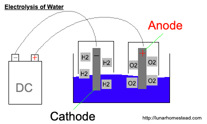

Overview
===

## The Problem
Lunar Homsteader's are faced with an interesting problem, with an efficient solution being vital to the success of any sustainable colony/habitat/homestead/study, on the Moon. They need to be able to breathe. That is obvious but the solution to the problem isn't always as clear.

I think it's important to note that the earth's atmosphere has a roughly 4:1 ratio of Nitrogen to Oxygen. We breath around 20% oxygen. Breathing 100% oxygen can be deadly(7), which will affect this research. For now I will focus on just the issue of collecting Oxygen. For further study, check out resource #8.

In this project, the goal is to aim for 1 SLHA (One Standard Lunar Homestead Atmosphere), the standard unit of atmospheric pressure and composition, created by Ben for Lunar Homestead(14). The reason for this is described in great depth in resource #14. This will require shipments of Nitrogen from Earth until we can figure out a better way to handle it. For now, that's our best bet.

`78% nitrogen/21% oxygen at 70.11 kPa (equivalent to 3000 meters elevation)` - 1 SLHA (14)

## Solutions

To begin, we'll examine the methods for keeping astronauts breathing aboard the ISS. This will give us a good starting point for determining the best ways to provide our Lunar Homesteader's with oxygen. At the end of each method section, I'll explain if and how that method could be used on Luna, our Moon.

### Electrolysis of Water

According to [Space Answers](www.spaceanswers.com)(4), the primary method for providing oxygen to astronauts aboard the ISS is through the electrolysis of water. Electrolysis is the process of using a direct electric current to drive a chemical reaction(2).

The electrolysis of water can split H2O into Hydrogen and Oxygen molecules. It can be a win-win because Hydrogen can also be used as a fuel source. Otherwise, it gets pumped out because you don't want to keep flammable material around unless it's going to be useful.

Through the Sabatier reaction(5), you can also end up using the hydrogen along with carbon dioxide, at 300-400°C, some pressure and a nickel catalyst to produce methane and water. So there's high desire and potential to recycle, but I digress.

Developments (from Chandrayaan-1 and M3) have shown us that there is water on the moon (15). Although Water can't persist on the surface, it can accumulate in "dark" areas, more often than not, near the poles. The amount of water that accumulates in those areas is unknown, but we can safely assume for this research that there won't be frozen lakes, where all we have to do is cut chunks out and melt them. According to resource #16, you could expect 32 ounces of water per ton of upper-layer lunar regolith. If there's more further below the surface or slowly gathering in craters near the poles, then we're in luck. I'm not here to speculate on if that could or couldn't happen. My primary goal here is to gather facts. For this project, we will assume that collecting water from the moon will require sifting through lots of regolith.

Getting water from regolith introduces some interesting issues...

Liquid water doesn't persist on the Moon's surface. The lower the atmospheric pressure, the lower the boiling point of water. So water on the surface would immediately start to boil and would turn to vapor. That vapor would then be bombarded with radiation from the sun, causing the Hydrogen and Oxygen molecules to split and lost to space. So sifting the regolith and shaking it around like a miner would pan for gold, wouldn't work.

more coming soon...

Further Reading:
1. [Engineering](./Engineering.md) > [Extracting Water from Lunar Regolith](./engineering/water-from-regolith.md)

### Compressed Air

coming soon...

### Vika oxygen generator
coming soon...

## Resources

1. https://en.wikipedia.org/wiki/International_Space_Station
2. https://en.wikipedia.org/wiki/Electrolysis
3. https://en.wikipedia.org/wiki/Water
4. Do they “make” oxygen to breathe on the ISS?. Jonathan O'Callaghan. October 26, 2012. [https://www.spaceanswers.com/space-exploration/do-they-make-oxygen-to-breathe-on-the-iss/] Last checked January 8, 2020.
5. https://en.wikipedia.org/wiki/Sabatier_reaction
6. https://en.wikipedia.org/wiki/Oxygen_storage
7. https://en.wikipedia.org/wiki/Oxygen_toxicity
8. Decompression Sickness. Richard E. Moon. [https://www.merckmanuals.com/home/injuries-and-poisoning/diving-and-compressed-air-injuries/decompression-sickness] Last checked January 9, 2020.
9. Closing the Loop: Recycling Water and Air in Space. NASA. [https://www.nasa.gov/pdf/146558main_RecyclingEDA%28final%29%204_10_06.pdf]. Last Checked January 8, 2020.
10. Air Supply: High Pressure Tanks Ready for Space Station. Stven Siceloff. [https://www.nasa.gov/content/air-supply-high-pressure-tanks-ready-for-space-station]. Last checked January 8, 2020.
11. Chlorate Oxygen Generator (Oxygen Candle): Review of the History of Candle Development. John Graf. February 2017. [https://ntrs.nasa.gov/archive/nasa/casi.ntrs.nasa.gov/20170002051.pdf] Last checked January 8, 2020.
12. https://en.wikipedia.org/wiki/Vika_oxygen_generator
13. https://en.wikipedia.org/wiki/ISS_ECLSS
14. http://lunarhomestead.com/2018/04/10/atmospheric-pressure-and-composition/
15. https://sservi.nasa.gov/articles/its-official-water-found-on-the-moon/
16. https://www.space.com/7328-official-water-moon.html

???. https://en.wikipedia.org/wiki/Lithium_perchlorate
