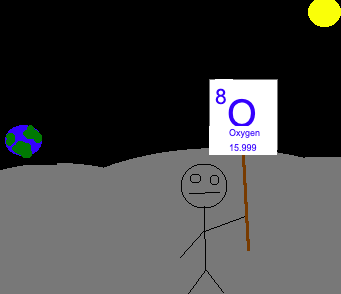

Lunar Oxygen Extraction Research
===

Lunar Oxygen Extraction Research is a research project of [Lunar Homestead](http://lunarhomestead.com/), originally created by Jesse Horne and maintained by the Lunar Homestead Crew.

# Purpose

The purpose of this project is to investigate, document and test efficient methods for extracting Oxygen on [Luna](https://en.wikipedia.org/wiki/Luna), the Earth's moon.

The importance of Oxygen, for Lunar Homesteaders, is obvious. The reason I believe that *this* project is important is because it will give a clear and friendly (but thorough) introduction to vital information that future Lunar Homesteader's will need to know. It allows me to contribute to solving a very real problem that confronts us all when we leave our atmosphere.

There is certainly a lot of research and information available already, on the subject, with physical products and solutions offered by a variety of different organizations. With that being said, the amount of information out there directly addressing the issue of oxygen extraction specifically from the Moon is miniscule. The goal of this project follows the [Lunar Homestead](http://lunarhomestead.com/) pledge to release accurate, informative research which is open for all to see, use and expand upon if they so desire.

TL;DR

LOER is a research project on extracting Oxygen from material on the Moon. This document will also teach you about current and proposed methods for doing so along with other relevant information a Lunar Homesteader might need to know when they're on the Moon and need to breathe.

# What next?

## 1. [Overview](./Overview.md)
## 2. [Engineering](./Engineering.md)
